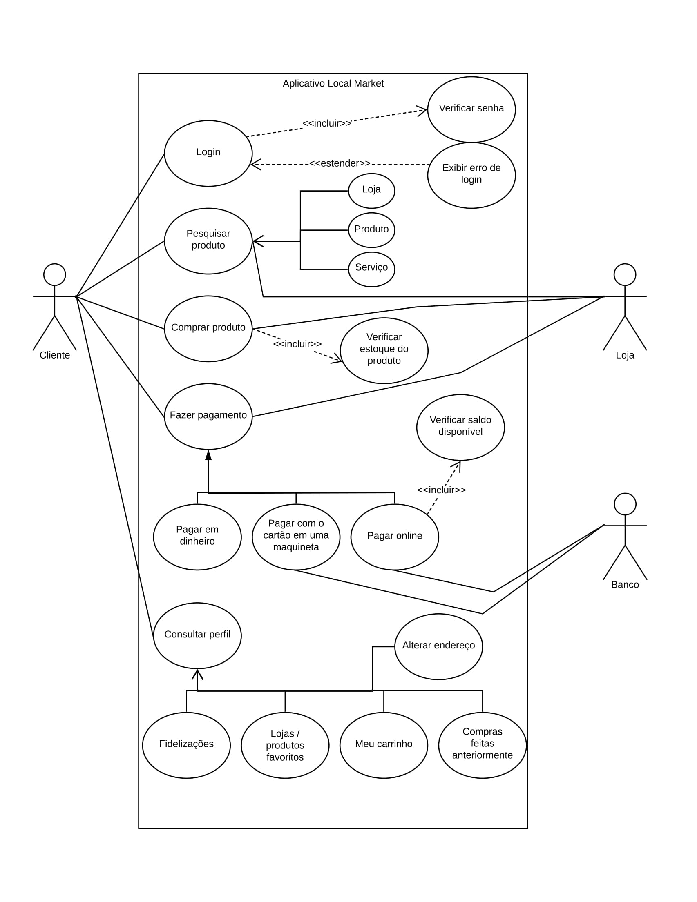
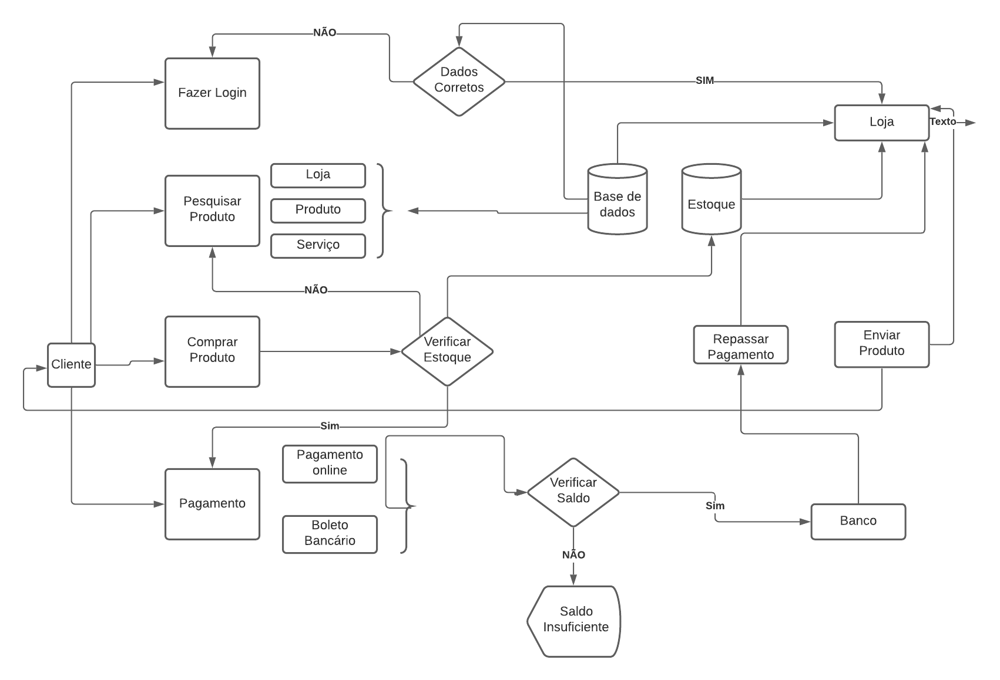

# Local Market

Os arquivos finais do projeto estão na pasta [./trabalho](./trabalho).  
A transcrição do arquivo [./trabalho/Relatório.pdf](./trabalho/Relatório.pdf) é dada abaixo.

## Relatório
Integrantes:  
José Caio Flôr Frota - 402678  
Francisco Henrique Rocha SIlva - 413563  
Antônio Ray Martins Vieira - 404583  
Leonardo José Magalhães da Silva - 427688  
Jonas Alves de Castro - 411358  
Roberto Paulo Gomes - 404036  

### 1. Local Market
O software pretende atender o mercado local de uma cidade funcionando tanto para
usuários que estão interessados em algum produto como para lojas/comércios que querem
divulgar o seu produto.

O software no modo usuário possui uma interface simples e de fácil uso contendo
funcionalidades como tela de pedidos, procurar produtos e tela de pagamento. No modo
empresa temos como funcionalidades a tela de pedidos podendo confirmar as vendas e
inventário onde a empresa pode cadastrar seus produtos.

### 2. Planejamento
O planejamento se deu exclusivamente através do aplicativo WhatsApp, foram
discutidas questões como divisão de conteúdo entre os membros da equipe, possível
orçamento do protótipo e discussão sobre os requisitos que o projeto deveria atender de
acordo com os dados das entrevistas. Após a divisão dos requisitos foi feito o diagrama UML
e o diagrama de caso de uso.

Após discussões a equipe decidiu implementar um sistema pensando em um mercado
local de uma cidade, principalmente após pesquisar sobre o assunto e verificar o impacto da
pandemia do coronavírus, a fim de suprir a necessidade de encontrar um catálogo de produtos
das lojas e unir isso com a necessidade de uma plataforma delivery possibilitando o
distanciamento social em virtude do coronavírus (COVID-19).

### 3. Modelagem
A UML - Unified Modeling Language é uma linguagem gráfica para visualizar,
especificar, construir e documentar um software através do uso de diagramas que são
compostos de gráficos, símbolos e texto permitindo compreender de forma detalhada e
conclusiva o software. Em outras palavras, diagrama são imagens, figuras ou esboço do
projeto desenhado no papel.

A figura 1 mostra o diagrama de caso de uso onde detalhamos o passo a passo do uso
do sistema.

  

Figura 1 - Diagrama de caso de uso

A Figura 2 traz o primeiro diagrama montado seguindo a UML como padrão para
modelagem orientada a objetos, e ponto de partida para o desenvolvimento de requisitos a
serem utilizados.

  

Figura 2 - Diagrama UML

### 4. Orçamento
Para análise do orçamento iremos incluir despesas em um ambiente de trabalho
próximo ao real que seriam sustentadas pela cobrança de dois serviços, o primeiro que
chamaremos de serviço A, será no caso da loja querer apenas divulgar os produtos por meio
do App que cobraremos uma taxa de R$ 1,00 para cada produto cadastrado pela loja. Caso a
loja queira utilizar efetivamente o App para realizar transações comerciais será cobrada uma
taxa de 10% sobre o valor da venda arrecadada utilizando o App, que chamaremos de serviço
B.

Na tabela que será disponibilizada iremos considerar que todas as lojas façam uso dos
dois serviços e cadastrem inicialmente 20 produtos. Para o primeiro mês de Janeiro vamos
considerar que haja 10 lojas utilizando o App. E esses valores tanto do número de lojas como
das quantidades de produtos cadastrados vão aumentar ao decorrer do tempo, assim como a
receita gerada pelo serviço B.

Analisando a parte de gastos teremos despesas com:

| Gastos Fixos Mensais   | $1.600,00 |
|------------------------|-----------|
| Aluguel                | $800,00   |
| Energia                | $200,00   |
| Internet/Telefone      | $150,00   |
| Transporte/Combustível | $250,00   |
| Contabilidade          | $100,00   |
| Material de escritório | $50,00    |
| Hospedagem site        | $50,00    |
| Gasto A                | $0,00     |
| Gasto B                | $0,00     |

Já na parte de gastos com mão de obra/pessoal por não termos um capital inicial e
dependermos apenas das receitas A e B tentaremos por meio de acordos estipular um
pequeno salário inicial para os funcionários que aumentará gradativamente, assim como
outros serviços. Tendo assim:

| Mão de Obra/Pessoal |                |     | $1.500,00 |
|---------------------|----------------|-----|-----------|
| Profissional        | Valor Unitário | Qtd | Total     |
| Programador         | $500,00        | 1   | $500,00   |
| Growth Hacking      | $0,00          | 0   | $0,00     |
| Marketing           | $500,00        | 1   | $500,00   |
| Web Designer        | $500,00        | 1   | $500,00   |
| Pro-laboe           | $0,00          | 0   | $0,00     |
| Suporte             | $0,00          | 0   | $0,00     |

A ideia seria ter Programadores para ajudar no desenvolvimento do site, Growth
Hacking para ampliar nossos planos de vendas dos serviços A e B, marketing para divulgação
do App , Web Designer para desenvolver a interface gráfica do App, além de elaborar umPro-Labore para caso haja algum investidor e por fim uma equipe de Suporte tanto para os
lojistas como usuários do App.

De forma resumida teremos a receita produzida pelos serviços A e B, e gastos que
foram mostrados nas tabelas.

Segue o link da tabela para orçamento de 3 anos:
https://drive.google.com/drive/folders/1ql3xiTqexisZEgiVN_DsSAvZH_lfH801?usp=

### 5. Protótipo do sistema
Após a análise dos requisitos do sistema, iniciamos a criação do protótipo. Utilizamos
um framework do Google, o flutter, que tem como a linguagem principal o dart. Com essa
ferramenta podemos criar um aplicativo nativo para android e ios.

O protótipo contará com um tela inicial, onde é possível fazer o cadastro como
usuário ou como empresa. Após o cadastramento a empresa fará o login que direciona para a
página de cadastro do produto com nome do produto, descrição, imagem e valor.

Para o usuário, será exibido uma página para pesquisa de produto por nome, em
sequência os produtos correspondentes aparecem em forma de lista, com as informações
adicionadas pelas empresas e um botão para adicionar o produto ao carrinho. Na página do
carrinho será exibida uma lista com os itens selecionados com um botão para definir a
quantidade de cada produto e um botão para finalizar compras. Ao finalizar as compras o
usuário poderá efetuar o pagamento em duas opções com dinheiro ou cartão.

### 6. Referências
\[1\] O IMPACTO DA PANDEMIA NO COMÉRCIO VAREJISTA. Estadão. Disponível em:
<[https://bit.ly/3sbLAy5](https://bit.ly/3sbLAy5)>. Acesso em março de 2021.

\[2\] O IMPACTO DA PANDEMIA DE CORONAVÍRUS NOS PEQUENOS NEGÓCIOS.
Sebrae. Disponível em: <[https://bit.ly/3sYp4tz](https://bit.ly/3sYp4tz)>. Acesso em março de 2021.
